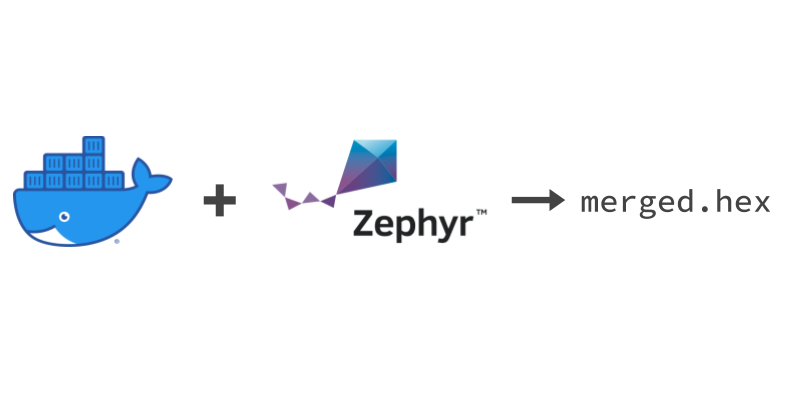

# Docker image for building nRF Connect SDK applications


(_the [Docker image](https://hub.docker.com/r/nordicplayground/nrfconnect-sdk) is build against [nRF Connect SDK](https://github.com/nrfconnect/sdk-nrf) `main`,`v2.1-branch`,`v2.0-branch`,`v1.9-branch`,`v1.8-branch`, `v1.7-branch`, `v1.6-branch`, `v1.5-branch`, and `v1.4-branch` every night._)

This project defines a Docker image that contains all dependencies to run `west` commands with the nRF Connect SDK. Bind mount the project folder you'd like to build, and the output will end up in the same folder (nested in build/zephyr subdir of the app).

The aim is to provide a Docker image that can compile application and samples in a [nRF Connect SDK](https://github.com/nrfconnect/sdk-nrf) release branch, not to exactly replicate the software configuration used when the release was made.

> ℹ️ Read more about this aproach [here](https://devzone.nordicsemi.com/nordic/nrf-connect-sdk-guides/b/getting-started/posts/build-ncs-application-firmware-images-using-docker).



Install `docker` on your operating system. On Windows you might want to use the [WSL subsystem](https://docs.docker.com/docker-for-windows/wsl-tech-preview/).

## Setup

You can either build the image from this repository or use a pre-built one from Dockerhub.

### Build image locally

Clone the repo:

```bash
git clone https://github.com/NordicPlayground/nrf-docker
```

Build the image (this is only needed once):

```bash
cd nrf-docker
docker build -t nrfconnect-sdk --build-arg sdk_nrf_revision=v2.1-branch .
```

> 🍏 _Note:_ To build for a Mac with the M1 architecture, you need to specify the `arm64` architecture when building: `--build-arg arch=arm64`.

> ℹ️ The `sdk_nrf_revision` build argument can be used to specify what version of the nRF Connect SDK that will be used when looking up dependencies with pip for the SDK and it's west dependency repositories. The value can be a git _tag_, _branch_ or _sha_ from the [nRF Connect SDK repository](https://github.com/nrfconnect/sdk-nrf).

### Use pre-built image from Dockerhub

> ℹ️ This is a convenient way to quickly build your firmware but using images from untrusted third-parties poses the risk of exposing your source code.
> There is no guarantee (e.g. cryptographic signature) about what this image contains.
> When publishing the image this project only ensures through automation that it can be used to build nRF Connect SDK examples.
> The entire image creation and publication is automated (build on GitHub Actions, and served by Dockerhub), which means there are multiple systems that can be compromised, during and after publication.
> No human is involved in verifying the image.
> In addition Docker images are not deterministic.
> At build time, dependencies are fetched from third-party sources and installed. These dependencies could also contain malicious code.
> If you are using this image you must be aware that you are using software from many untrusted sources with all the consequences that brings.

> 🍏 _Note:_ The prebuilt images are not available for `arm64` architecture (Apple M1), because GitHub Actions don't have hosted runners with Apple M1 yet.

To use the pre-built image [`nordicplayground/nrfconnect-sdk:main`](https://hub.docker.com/r/nordicplayground/nrfconnect-sdk); add `nordicplayground/` before the image name and `:tag` after. Replace `tag` with one of the [available tags](https://hub.docker.com/r/nordicplayground/nrfconnect-sdk/tags) on the Dockerhub image. The only difference between the tags are which Python dependencies are pre-installed in the image based on the different `requirements.txt` files from the nRF Connect SDK repository's west dependencies.

```bash
docker run --rm -v ${PWD}:/workdir/project nordicplayground/nrfconnect-sdk:main ...
```

The rest of the documentation will use the local name `nrfconnect-sdk`, but any of them can use `nordicplayground/nrfconnect-sdk:main` (or a different tag) instead.

### Initialize and update west dependencies

Setting up the nRF Connect SDK to build sample applications and a stand-alone repository is a bit different, so we'll demonstrate both.

#### Using the nRF Connect SDK

```bash
mkdir nrfconnect && cd nrfconnect
docker run --rm -v ${PWD}:/workdir/project nrfconnect-sdk /bin/bash -c '\
    west init -m https://github.com/nrfconnect/sdk-nrf && \
    west update --narrow -o=--depth=1'
```

#### Using it with an out-of-tree repository

Because west installs the dependency repository in the parent-folder of the project folder we need to have an extra subfolder where the custom firmware code is located. Then the containing folder can be mounted when running the container and the output from west will be stored alongside the custom firmware folder. Here's an example folder layout for the `my-application`:

    build-with-nrf-connect-sdk
    ├── bootloader
    ├── mbedtls
    ├── modules
    ├── my-application
    ├── nrf
    ├── nrfxlib
    ├── test
    ├── tools
    └── zephyr

Now we can initialize the image for use with our out-of-tree firmware folder:

```bash
mkdir build-with-nrf-connect-sdk && cd build-with-nrf-connect-sdk
git clone https://github.com/my-org/my-application
docker run --rm -v ${PWD}:/workdir/project nrfconnect-sdk /bin/bash -c '\
    cd my-application && \
    west init -l && \
    west update --narrow -o=--depth=1'
```

### Build the firmware

To demonstrate, we'll build the _asset_tracker_v2_ application from sdk-nrf:

```bash
docker run --rm -v ${PWD}:/workdir/project \
    -w /workdir/project/nrf/applications/asset_tracker_v2 \
    nrfconnect-sdk \
    west build -p always -b nrf9160dk_nrf9160_ns
```

The firmware file will be located here: `nrf/applications/asset_tracker_v2/build/zephyr/merged.hex`. Because it's inside the folder that is bind mounted when running the image, it is also available outside of the Docker image.

> ℹ️ The `-p always` build argument is to do a pristine build. It is similar to cleaning the build folder and is used because it is less error-prone to a previous build with different configuration. To speed up subsequent build with the same configuration you can remove this argument to avoid re-building code that haven't been modified since the previous build.

To build a stand-alone project, replace `-w /workdir/project/nrf/applications/asset_tracker_v2` with the name of the applications folder inside the docker container:

```bash
# run from the build-with-nrf-connect-sdk
docker run --rm -v ${PWD}:/workdir/project \
    -w /workdir/project/my-application \
    nrfconnect-sdk \
    west build -p always -b nrf9160dk_nrf9160_ns
```

## Full example

```bash
# build docker image
git clone https://github.com/NordicPlayground/nrf-docker
cd nrf-docker
docker build -t nrfconnect-sdk --build-arg sdk_nrf_revision=v2.1-branch .
cd ..

# initialize sdk-nrf and build asset_tracker_v2 application
mkdir nrfconnect && cd nrfconnect
docker run --rm -v ${PWD}:/workdir/project nrfconnect-sdk /bin/bash -c '\
    west init -m https://github.com/nrfconnect/sdk-nrf --mr v2.1-branch && \
    west update --narrow -o=--depth=1 && \
    cd nrf/applications/asset_tracker_v2 && \
    west build -p always -b nrf9160dk_nrf9160_ns'
ls -la nrf/applications/asset_tracker_v2/build/zephyr/merged.hex
```

> ℹ️ The `--mr` argument to `west init` specifies the manifest revision, which is the same as the SDK version. It can be a _branch_, _tag_ or a _sha_. It's recommended to select a recent stable version. Which will be tagged. See available [tags in the sdk-nrf repo](https://github.com/nrfconnect/sdk-nrf/tags).

### Build a Zephyr sample using the hosted image

This builds the `hci_uart` sample and stores the `hci_uart.hex` file in the current directory:

```bash
# assumes `west init` and `west update` from before
docker run --rm -v ${PWD}:/workdir/project nordicplayground/nrfconnect-sdk:main \
    west build zephyr/samples/bluetooth/hci_uart -p always -b nrf9160dk_nrf52840
ls -la build/zephyr && cp build/zephyr/zephyr.hex ./hci_uart.hex
```

#### nRF5280 DK example

```bash
# Init and build in Docker
docker run --rm -v ${PWD}:/workdir/project nrfconnect-sdk /bin/bash -c '\
    west init -m https://github.com/nrfconnect/sdk-nrf --mr v2.1-branch && \
    west update --narrow -o=--depth=1 && \
    west build zephyr/samples/bluetooth/peripheral_ht -p always -b nrf52840dk_nrf52840'

# Access build files
cp build/zephyr/zephyr.hex peripheral_ht.hex
ls -la ./peripheral_ht.hex
```

## Flashing

> ℹ️ Docker for Mac OS and Windows does not have support for USB yet, so this will only work on Linux computers.

```bash
# assumes asset_tracker_v2 built already (see above)
docker run --rm -v ${PWD}:/workdir/project \
    -w /workdir/project/nrf/applications/asset_tracker_v2 \
    --device=/dev/ttyACM0 --privileged \
    nrfconnect-sdk \
    west flash
```

## ClangFormat

The image comes with [ClangFormat](https://clang.llvm.org/docs/ClangFormat.html) and the [nRF Connect SDK formatting rules](https://github.com/nrfconnect/sdk-nrf/blob/main/.clang-format) so you can run for example

```bash
docker run --name nrfconnect-sdk -d nordicplayground/nrfconnect-sdk tail -f /dev/null
find ./src -type f -iname \*.h -o -iname \*.c \
    | xargs -I@ /bin/bash -c "\
        tmpfile=\$(mktemp /tmp/clang-formatted.XXXXXX) && \
        docker exec -i nrfconnect-sdk clang-format < @ > \$tmpfile && \
        cmp --silent @ \$tmpfile || (mv \$tmpfile @ && echo @ formatted.)"
docker kill nrfconnect-sdk
docker rm nrfconnect-sdk
```

to format your sources.

> ℹ️ Instead of having `clang-format` overwrite the source code file itself, the above command passes the source code file on stdin to clang-format and then overwrites it outside of the container. Otherwise the overwritten file will be owner by the root user (because the Docker daemon is run as root).

## Interactive usage

```bash
# from a folder you've initialized with west already
docker run -it --name nrfconnect-sdk -v ${PWD}:/workdir/project \
    nrfconnect-sdk /bin/bash
```

> ℹ️ On Linux add `--device=/dev/ttyACM0 --privileged` to be able to flash from the Docker container.

Then, inside the container:

```bash
cd nrf/applications/asset_tracker_v2
west build -p always -b nrf9160dk_nrf9160_ns
west flash # only works on linux - use nrf desktop tools on Windows/Mac OS
west build
...
```

Meanwhile, inside or outside of the container, you may modify the code and repeat the build/flash cycle.

Later after closing the container you may re-open it by name to continue where you left off:

```bash
docker start -i nrfconnect-sdk
```
